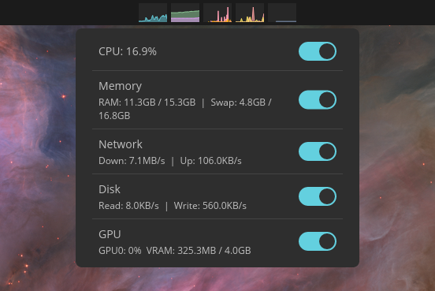

# cosmic-ext-applet-sysmon

A system monitor applet for the [COSMIC](https://github.com/pop-os/cosmic-epoch) desktop. Shows CPU, RAM, swap, network, disk, and GPU usage as live sparkline charts in the panel. Click the applet to open a popup with live metric summaries and toggles to show/hide each component.



This is a fork of [D-Brox/cosmic-ext-applet-system-monitor](https://github.com/D-Brox/cosmic-ext-applet-system-monitor) with two key changes:

- **No wgpu dependency** — runs on the tiny_skia software renderer only, so it launches faster and works without a GPU driver
- **Three iced tiny_skia bug fixes** that were required to make Canvas widgets render correctly without wgpu (see [docs/iced-tiny-skia-canvas-damage-bug.md](docs/iced-tiny-skia-canvas-damage-bug.md))

## Features

- **Live sparkline charts** — CPU, RAM/swap, network, disk I/O, and GPU usage rendered as run charts and bar charts directly in the panel
- **Click-to-open popup** — shows current metric values at a glance (CPU %, RAM/swap usage, network rates, disk I/O, GPU utilization and VRAM)
- **Per-component visibility toggles** — show or hide individual charts from the popup; settings persist across sessions via cosmic-config
- **Icon fallback** — when all charts are hidden, the applet shows its icon so the popup remains accessible
- **Configurable** — chart colors, aspect ratios, sampling intervals, and layout are all configurable via cosmic-config

## Installation

Requires [just](https://github.com/casey/just).

```sh
just dev-install   # one-time setup: symlinks binary into ~/.local/bin, installs desktop/icon/metadata
just dev-reload    # rebuild + restart cosmic-panel (for iterative development)
just install-user  # copy binary to ~/.local (no root needed)
just install       # install system-wide (requires root)
```

On NixOS, prefix commands with `direnv exec .` (or enter the direnv shell) since the toolchain comes from nix.

## Differences from upstream

| | [upstream](https://github.com/D-Brox/cosmic-ext-applet-system-monitor) | this fork |
|---|---|---|
| Renderer | wgpu (GPU) | tiny_skia (software) |
| Startup time | slower (wgpu init) | faster |
| GPU required | yes (for wgpu) | no |
| Popup | no | click-to-open with toggles |

The iced tiny_skia fixes in this fork have been submitted upstream and may be merged into [pop-os/iced](https://github.com/pop-os/iced) in the future.

## Packaging

```sh
just vendor
just build-vendored
just rootdir=debian/cosmic-ext-applet-sysmon prefix=/usr install
```

## Translators

Translation files are in [i18n/](./i18n) using [Fluent](https://projectfluent.org/). Copy the [English](./i18n/en) directory, rename it to your [ISO 639-1 language code](https://en.wikipedia.org/wiki/List_of_ISO_639-1_codes), and translate the messages.
